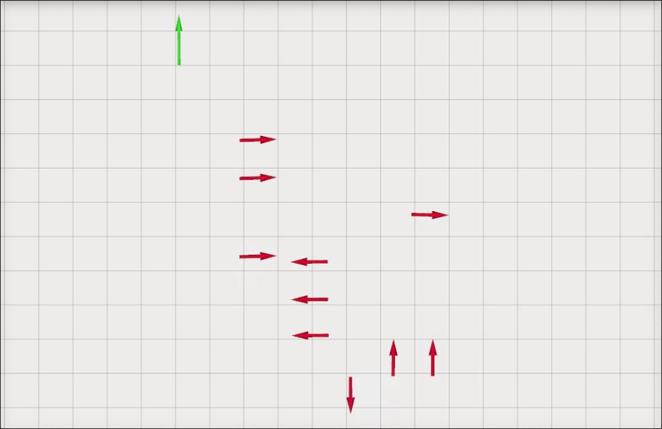

# Load Carriers Tracker
## Additional libraries
### Unique ID (For UUID generation)
```
sudo apt-get install ros-noetic-unique-id
```
## Usage
First, run the transform_detections node to transform the detections from robot frame to the global CS.
```
rosrun load_carriers_tracker transform_detections_node
```
Then, launch the carrier_trackers.launch file.
```
roslaunch load_carriers_tracker carrier_trackers.launch
```

## Results


## Solution explanation
The transform_detections_node reads the data from the topic /detection and /robotPose. In this node, a robot pose transformation is used to transform the detections from robot coordinate from to global CS. The transformed detection poses are then published using a geometry_msgs::PoseArray. By using this node separately to process the data and publish it before filtering the implementation of the filtering stage is simplified.

The filtering itself was done by using a Kalman Filter for x, y, and theta separately. Even though this is a simple method, I expect it to work because we are assumming that the objects do not move. The kalman_filter.hpp header contains the implementation of the Kalman Filter.

The ObjectTracker class is responsible for handling the data of each detected object separately. This class contains the instances of the KalmanFilter and performs the filtering itlself. The constructuor generates a unique ID using a standard ROS UUID generation package, then it initializes the object pose to the first given pose and sets the initial parameters of each filter. The update() method receives a geometry_msgs::Pose msg and performs the pose estimation of each of the coordinates of the object (x, y, theta) using the pose information. In this method, I have skipped the update for the detections whose orientation flip with respect to the current estimation.

The CarriersTracker class handles the instances of the ObjectTracker for each of the detections using a vector container named carriers_. It has another vector cycles_without_detection_, directly related to the objects, to count the number of cycles without a detection which is used to later remove objects from the carriers_ vector. This class subscribes to the geometry_msgs::PoseArray published by transform_detections_node, finds a match between the incoming detected poses and the current objects, and either performs an update to the existing object or create a new object if no match is found. The matching policy is done by comparing the distance between the incoming poses and all the existing objects inside carriers_. The parameter match_th is used to define the threshold at which a match is positive.

To remove carriers that have not been detected for a while, in each cycle I check if the number of cycles without detection is greater than the parameter max_cycles_without_detection. If it does, the object is removed from the carriers_ vector, and the element with the same index is removed from the cycles_without_detection_ vector. Finally, the filtered detections are published to the topic /filtered_detection by using the geometry_msgs::PoseArray msg.

The carriers_tracker_node.cpp is used just to instantiate the CarrierTracker object and start ROS spin.